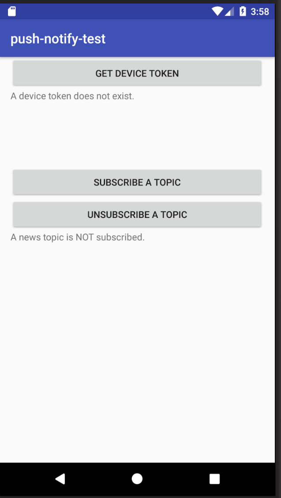

# Push Notification Sample App for Android with Firebase Cloud Messaging

This application is push notification sample for Android with [Firebase Cloud Messaging (FCM)](https://firebase.google.com/docs/cloud-messaging/). Feel free to use this application to try push notification!

## How to build
1. Clone this project.
1. Get google-services.json from Firebase console and put to your project's module directory, typically `app/`.
1. Build application with Android Studio and run application.
1. Enjoy!

## License
MIT
